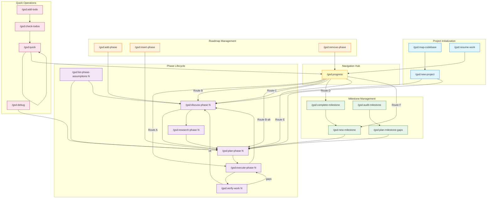
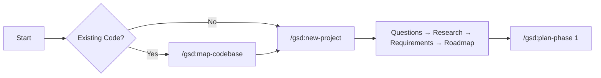
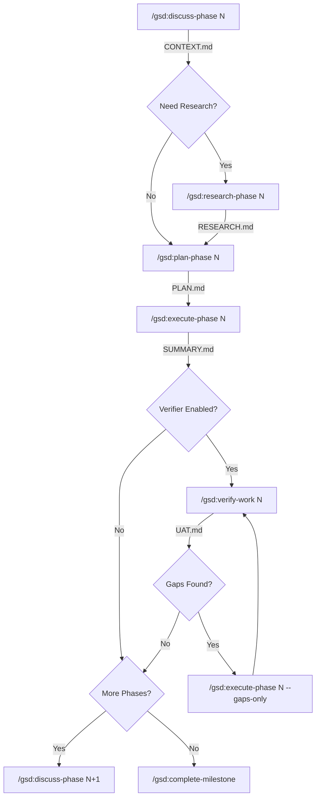
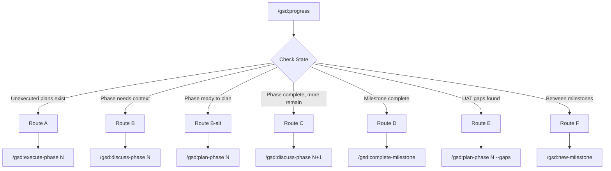
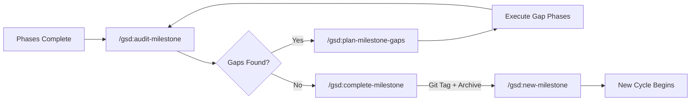
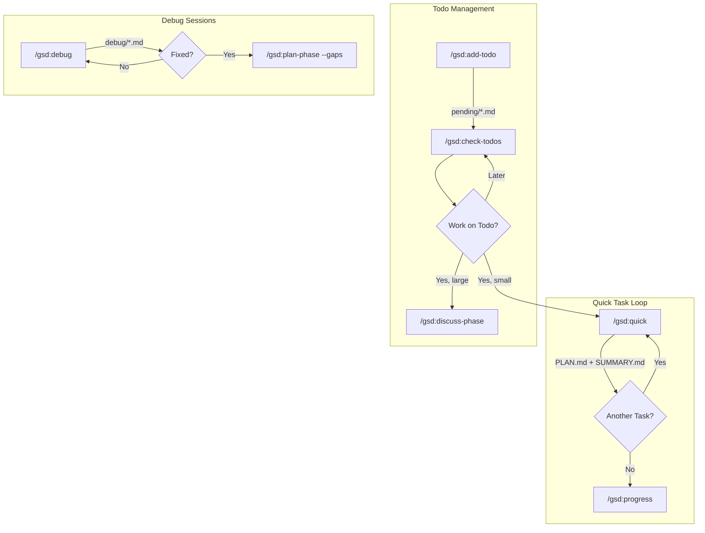
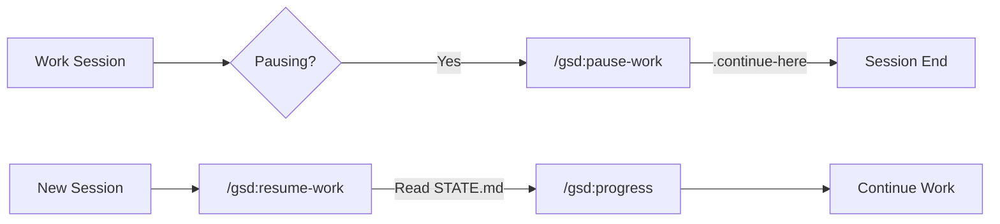
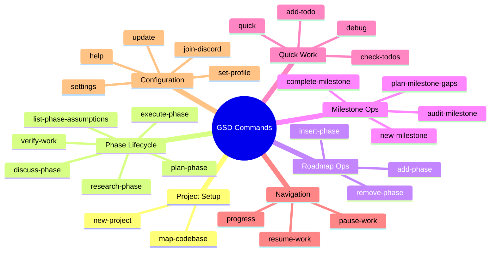

# GSD (Get Shit Done) - Workflow Reference

Complete command reference with flow diagrams for the GSD Claude Code plugin system.

---

## Command Quick Reference

| Command | Quick Goal | Next Step(s) |
|---------|------------|--------------|
| `/gsd:new-project` | Initialize greenfield project with full discovery flow | `/gsd:plan-phase 1` or `/gsd:discuss-phase 1` |
| `/gsd:map-codebase` | Analyze existing codebase (brownfield) | `/gsd:new-project` |
| `/gsd:discuss-phase N` | Gather context through questioning | `/gsd:plan-phase N` or `/gsd:research-phase N` |
| `/gsd:research-phase N` | Deep domain/ecosystem research | `/gsd:plan-phase N` |
| `/gsd:list-phase-assumptions N` | Preview Claude's assumptions | `/gsd:plan-phase N` or `/gsd:discuss-phase N` |
| `/gsd:plan-phase N` | Create detailed execution plan | `/gsd:execute-phase N` |
| `/gsd:execute-phase N` | Execute all plans with wave parallelization | `/gsd:verify-work N` or `/gsd:discuss-phase N+1` |
| `/gsd:verify-work N` | Conversational UAT validation | `/gsd:execute-phase N --gaps-only` or `/gsd:discuss-phase N+1` |
| `/gsd:add-phase` | Add phase to end of milestone | `/gsd:discuss-phase N` |
| `/gsd:insert-phase N` | Insert urgent work as decimal phase | `/gsd:plan-phase N.1` |
| `/gsd:remove-phase N` | Remove future phase, renumber | `/gsd:progress` |
| `/gsd:new-milestone` | Start new milestone cycle | `/gsd:plan-phase N` |
| `/gsd:complete-milestone` | Archive milestone, create git tag | `/gsd:new-milestone` |
| `/gsd:audit-milestone` | Audit completion vs original intent | `/gsd:plan-milestone-gaps` |
| `/gsd:plan-milestone-gaps` | Create phases for audit gaps | `/gsd:plan-phase N` |
| `/gsd:quick` | Execute small ad-hoc task | `/gsd:quick` or `/gsd:progress` |
| `/gsd:progress` | Check status, route to next action | Context-dependent (6 routes) |
| `/gsd:resume-work` | Restore session context | `/gsd:progress` |
| `/gsd:pause-work` | Create handoff for pause | Resume later |
| `/gsd:add-todo` | Capture idea as todo | `/gsd:check-todos` |
| `/gsd:check-todos` | List and select todo to work | Work on todo or `/gsd:quick` |
| `/gsd:debug` | Systematic debugging with persistence | `/gsd:plan-phase N --gaps` |
| `/gsd:settings` | Configure workflow toggles | `/gsd:progress` |
| `/gsd:set-profile` | Switch model profile | Any command |
| `/gsd:help` | Show command reference | Any command |
| `/gsd:update` | Update GSD to latest | Any command |
| `/gsd:join-discord` | Join community | External |

---

## Master Flow Diagram



---

## Detailed Command Flows

### 1. Project Start Flow



**Files Created:**
- `.planning/PROJECT.md` - Vision and context
- `.planning/REQUIREMENTS.md` - Scoped requirements
- `.planning/ROADMAP.md` - Phase breakdown
- `.planning/STATE.md` - Project memory
- `.planning/config.json` - Workflow settings

---

### 2. Phase Development Flow



**Files Created per Phase:**
```
.planning/phases/NN-name/
├── NN-MM-CONTEXT.md   # From discuss-phase
├── NN-MM-RESEARCH.md  # From research-phase (optional)
├── NN-MM-PLAN.md      # From plan-phase
├── NN-MM-SUMMARY.md   # From execute-phase
└── NN-MM-UAT.md       # From verify-work
```

---

### 3. Progress Router Logic



---

### 4. Milestone Lifecycle



---

### 5. Quick Operations Flow



---

### 6. Session Management



---

## File Structure Overview

```
.planning/
├── PROJECT.md              # Project vision (new-project, new-milestone)
├── ROADMAP.md              # Phase breakdown
├── STATE.md                # Project memory (all commands update)
├── REQUIREMENTS.md         # Scoped requirements
├── config.json             # Workflow mode, model profile
├── MILESTONES.md           # Archived milestones
├── MILESTONE-AUDIT.md      # Audit results
│
├── research/               # Domain research (new-project, new-milestone)
│   └── *.md
│
├── codebase/               # Brownfield analysis (map-codebase)
│   ├── TECH-STACK.md
│   ├── ARCHITECTURE.md
│   ├── CODE-QUALITY.md
│   ├── CONVENTIONS.md
│   ├── INTEGRATION-POINTS.md
│   ├── SENSITIVE-AREAS.md
│   └── KEY-CONCERNS.md
│
├── todos/
│   ├── pending/            # Active todos (add-todo)
│   └── done/               # Completed (check-todos)
│
├── debug/                  # Debug sessions (debug)
│   └── *.md
│
├── quick/                  # Quick tasks (quick)
│   └── NNN-slug/
│       ├── PLAN.md
│       └── SUMMARY.md
│
└── phases/
    └── NN-name/            # Phase artifacts
        ├── NN-MM-CONTEXT.md
        ├── NN-MM-RESEARCH.md
        ├── NN-MM-PLAN.md
        ├── NN-MM-SUMMARY.md
        └── NN-MM-UAT.md
```

---

## Typical Workflow Scenarios

### Scenario A: New Greenfield Project
```
/gsd:new-project → /gsd:plan-phase 1 → /gsd:execute-phase 1 →
/gsd:verify-work 1 → /gsd:discuss-phase 2 → ... → /gsd:complete-milestone
```

### Scenario B: Brownfield Project
```
/gsd:map-codebase → /gsd:new-project → /gsd:discuss-phase 1 →
/gsd:plan-phase 1 → /gsd:execute-phase 1 → ...
```

### Scenario C: Resume After Break
```
/gsd:resume-work → /gsd:progress → (routes to appropriate command)
```

### Scenario D: Quick Bug Fix
```
/gsd:quick → (fix applied) → /gsd:progress
```

### Scenario E: Add Urgent Feature Mid-Milestone
```
/gsd:insert-phase 3 "Urgent security fix" → /gsd:plan-phase 3.1 →
/gsd:execute-phase 3.1 → /gsd:progress
```

---

## Key Design Patterns

1. **Intelligent Routing** - `/gsd:progress` analyzes state and suggests the right next command
2. **Wave Execution** - Plans execute in parallel waves for efficiency
3. **Context Persistence** - `STATE.md` survives across sessions and `/clear`
4. **Atomic Operations** - Files written before commits for crash safety
5. **Model Profiles** - Commands respect quality/balanced/budget settings
6. **Verification Loop** - UAT catches gaps before moving forward

---

## Command Categories

Organizing the 27 GSD commands into logical categories helps understand when and why to use each one.

### Category Overview



### Category Details

#### 1. Project Setup (2 commands)
**Purpose:** Initialize or understand a project before starting work.

| Command | When to Use |
|---------|-------------|
| `/gsd:new-project` | Starting a greenfield project OR after mapping brownfield code |
| `/gsd:map-codebase` | Analyzing existing codebase before adding features |

**Flow:** `map-codebase` (if needed) → `new-project`

---

#### 2. Phase Lifecycle (6 commands)
**Purpose:** The core development loop for each phase of work.

| Command | When to Use |
|---------|-------------|
| `/gsd:discuss-phase N` | Gathering context and requirements for a phase |
| `/gsd:research-phase N` | Deep technical/domain research (optional) |
| `/gsd:list-phase-assumptions N` | Preview Claude's assumptions before planning |
| `/gsd:plan-phase N` | Create detailed execution plan with tasks |
| `/gsd:execute-phase N` | Run all plans with wave-based parallelization |
| `/gsd:verify-work N` | Conversational UAT to validate deliverables |

**Flow:** `discuss` → `research` (optional) → `plan` → `execute` → `verify`

---

#### 3. Roadmap Operations (3 commands)
**Purpose:** Modify the phase structure of the current milestone.

| Command | When to Use |
|---------|-------------|
| `/gsd:add-phase` | Add new phase at end of milestone |
| `/gsd:insert-phase N` | Insert urgent work between phases (creates N.1, N.2, etc.) |
| `/gsd:remove-phase N` | Remove a future phase and renumber |

**Use Case:** Mid-milestone scope changes, urgent features, descoping

---

#### 4. Milestone Operations (4 commands)
**Purpose:** Manage the milestone lifecycle from start to archive.

| Command | When to Use |
|---------|-------------|
| `/gsd:new-milestone` | Start a new version/milestone cycle |
| `/gsd:audit-milestone` | Check if milestone goals were achieved |
| `/gsd:plan-milestone-gaps` | Create phases for audit-identified gaps |
| `/gsd:complete-milestone` | Archive milestone, create git tag, prepare for next |

**Flow:** (all phases done) → `audit` → `plan-milestone-gaps` (if needed) → `complete` → `new-milestone`

---

#### 5. Quick Work (4 commands)
**Purpose:** Handle small tasks, bugs, and ideas without full phase overhead.

| Command | When to Use |
|---------|-------------|
| `/gsd:quick` | Execute small ad-hoc task with GSD guarantees |
| `/gsd:add-todo` | Capture idea/task for later |
| `/gsd:check-todos` | Review pending todos, select one to work |
| `/gsd:debug` | Systematic debugging with persistent state |

**Use Case:** Bug fixes, small features, capturing ideas, investigation

---

#### 6. Navigation (3 commands)
**Purpose:** Move through the workflow and manage sessions.

| Command | When to Use |
|---------|-------------|
| `/gsd:progress` | **Central hub** - analyzes state, suggests next action |
| `/gsd:resume-work` | Start new session, restore context |
| `/gsd:pause-work` | End session, create handoff notes |

**Tip:** When unsure what to do next, always use `/gsd:progress`

---

#### 7. Configuration (5 commands)
**Purpose:** Customize GSD behavior and get help.

| Command | When to Use |
|---------|-------------|
| `/gsd:settings` | Toggle workflow features (verifier, researcher, etc.) |
| `/gsd:set-profile` | Switch model profile (quality/balanced/budget) |
| `/gsd:help` | Show command reference |
| `/gsd:update` | Update GSD to latest version |
| `/gsd:join-discord` | Join community for support |

---

### Category Selection Guide

```
┌─────────────────────────────────────────────────────────────────┐
│                    "What should I use?"                         │
├─────────────────────────────────────────────────────────────────┤
│                                                                 │
│  Starting fresh?                                                │
│    └─→ Project Setup: new-project (+ map-codebase if existing) │
│                                                                 │
│  Working on a phase?                                            │
│    └─→ Phase Lifecycle: discuss → plan → execute → verify      │
│                                                                 │
│  Need to change scope?                                          │
│    └─→ Roadmap Ops: add/insert/remove phase                    │
│                                                                 │
│  Finishing a version?                                           │
│    └─→ Milestone Ops: audit → complete → new-milestone         │
│                                                                 │
│  Small task or bug?                                             │
│    └─→ Quick Work: quick, debug, or add-todo                   │
│                                                                 │
│  Lost or resuming?                                              │
│    └─→ Navigation: progress or resume-work                     │
│                                                                 │
│  Tweaking behavior?                                             │
│    └─→ Configuration: settings, set-profile                    │
│                                                                 │
└─────────────────────────────────────────────────────────────────┘
```

### Mental Model

Think of GSD as **three concentric loops**:

1. **Inner Loop (Phase):** discuss → plan → execute → verify
2. **Middle Loop (Milestone):** phases 1-N → audit → complete
3. **Outer Loop (Project):** milestones v0.1 → v0.2 → v1.0

With **quick operations** as a "side channel" for small work that doesn't need full phase treatment.

```
┌─────────────────────────────────────────────────────────────┐
│ PROJECT (new-project, map-codebase)                         │
│  ┌───────────────────────────────────────────────────────┐  │
│  │ MILESTONE (new-milestone, audit, complete)            │  │
│  │  ┌─────────────────────────────────────────────────┐  │  │
│  │  │ PHASE (discuss, plan, execute, verify)          │  │  │
│  │  │    ↻ repeat for each phase                      │  │  │
│  │  └─────────────────────────────────────────────────┘  │  │
│  │     ↻ repeat for each milestone                       │  │
│  └───────────────────────────────────────────────────────┘  │
│                                                             │
│  ═══ QUICK WORK (quick, debug, todos) ═══ side channel ══  │
└─────────────────────────────────────────────────────────────┘
```

---

## Command Arguments & Flags Reference

Comprehensive reference for all GSD command arguments, flags, and their usage patterns.

### Summary Table

| Command | Arguments | Required | Flags | Interactive |
|---------|-----------|----------|-------|-------------|
| `add-phase` | `<description>` | ✅ | — | No |
| `add-todo` | `[description]` | ❌ | — | Yes (if no arg) |
| `audit-milestone` | `[version]` | ❌ | — | No |
| `check-todos` | `[area]` | ❌ | — | Yes |
| `complete-milestone` | `<version>` | ✅ | — | No |
| `debug` | `[issue description]` | ❌ | — | Yes |
| `discuss-phase` | `<phase>` | ✅ | — | Yes |
| `execute-phase` | `<phase-number>` | ✅ | `--gaps-only` | No |
| `help` | — | — | — | No |
| `insert-phase` | `<after>` `<description>` | ✅ | — | No |
| `join-discord` | — | — | — | No |
| `list-phase-assumptions` | `[phase]` | ❌ | — | No |
| `map-codebase` | `[area]` | ❌ | — | No |
| `new-milestone` | `[name]` | ❌ | — | Yes |
| `new-project` | — | — | — | Yes |
| `pause-work` | — | — | — | No |
| `plan-milestone-gaps` | — | — | — | No |
| `plan-phase` | `[phase]` | ❌ | `--research`, `--skip-research`, `--gaps`, `--skip-verify` | No |
| `progress` | — | — | — | No |
| `quick` | — | — | — | Yes |
| `remove-phase` | `<phase-number>` | ✅ | — | No |
| `research-phase` | `<phase>` | ✅ | — | No |
| `resume-work` | — | — | — | No |
| `set-profile` | `<profile>` | ✅ | — | No |
| `settings` | — | — | — | Yes |
| `update` | — | — | — | No |
| `verify-work` | `[phase]` | ❌ | — | Yes |

**Legend:**
- ✅ Required = Must provide argument
- ❌ Required = Optional argument
- Interactive = Prompts user for input during execution

---

### Detailed Command Reference

#### Project Setup Commands

##### `/gsd:new-project`
Initialize a new project with full discovery flow.

```
Syntax: /gsd:new-project
```

| Parameter | Type | Required | Description |
|-----------|------|----------|-------------|
| — | — | — | No arguments; launches interactive discovery |

**Behavior:** Spawns questioning flow, creates PROJECT.md, REQUIREMENTS.md, ROADMAP.md

---

##### `/gsd:map-codebase`
Analyze existing codebase before adding features.

```
Syntax: /gsd:map-codebase [area]
```

| Parameter | Type | Required | Default | Description |
|-----------|------|----------|---------|-------------|
| `area` | string | No | all | Focus area: `tech`, `arch`, `quality`, `concerns`, or `all` |

**Examples:**
```bash
/gsd:map-codebase              # Analyze entire codebase
/gsd:map-codebase tech         # Focus on tech stack analysis
/gsd:map-codebase quality      # Focus on code quality assessment
```

---

#### Phase Lifecycle Commands

##### `/gsd:discuss-phase`
Gather context through adaptive questioning before planning.

```
Syntax: /gsd:discuss-phase <phase>
```

| Parameter | Type | Required | Description |
|-----------|------|----------|-------------|
| `phase` | number | Yes | Phase number to discuss (e.g., `1`, `2`, `3.1`) |

**Examples:**
```bash
/gsd:discuss-phase 1           # Discuss phase 1
/gsd:discuss-phase 3.1         # Discuss inserted phase 3.1
```

---

##### `/gsd:research-phase`
Deep domain/ecosystem research for a phase.

```
Syntax: /gsd:research-phase <phase>
```

| Parameter | Type | Required | Description |
|-----------|------|----------|-------------|
| `phase` | number | Yes | Phase number to research |

**Output:** Creates `NN-MM-RESEARCH.md` in phase directory

---

##### `/gsd:list-phase-assumptions`
Surface Claude's assumptions about a phase approach before planning.

```
Syntax: /gsd:list-phase-assumptions [phase]
```

| Parameter | Type | Required | Default | Description |
|-----------|------|----------|---------|-------------|
| `phase` | number | No | current | Phase number to analyze assumptions for |

**Examples:**
```bash
/gsd:list-phase-assumptions    # Assumptions for current phase
/gsd:list-phase-assumptions 2  # Assumptions for phase 2
```

---

##### `/gsd:plan-phase`
Create detailed execution plan with verification loop.

```
Syntax: /gsd:plan-phase [phase] [flags]
```

| Parameter | Type | Required | Default | Description |
|-----------|------|----------|---------|-------------|
| `phase` | number | No | current | Phase number to plan |

| Flag | Type | Default | Description |
|------|------|---------|-------------|
| `--research` | boolean | false | Force research phase before planning |
| `--skip-research` | boolean | false | Skip research even if enabled in settings |
| `--gaps` | boolean | false | Plan only for UAT-identified gaps |
| `--skip-verify` | boolean | false | Skip plan verification step |

**Examples:**
```bash
/gsd:plan-phase                # Plan current phase
/gsd:plan-phase 2              # Plan phase 2
/gsd:plan-phase 2 --research   # Research then plan phase 2
/gsd:plan-phase --gaps         # Plan gap remediation
/gsd:plan-phase --skip-verify  # Skip plan checker agent
```

---

##### `/gsd:execute-phase`
Execute all plans with wave-based parallelization.

```
Syntax: /gsd:execute-phase <phase-number> [flags]
```

| Parameter | Type | Required | Description |
|-----------|------|----------|-------------|
| `phase-number` | number | Yes | Phase number to execute |

| Flag | Type | Default | Description |
|------|------|---------|-------------|
| `--gaps-only` | boolean | false | Execute only gap remediation tasks |

**Examples:**
```bash
/gsd:execute-phase 1           # Execute phase 1
/gsd:execute-phase 2 --gaps-only  # Execute only gap fixes for phase 2
```

---

##### `/gsd:verify-work`
Conversational UAT validation of completed work.

```
Syntax: /gsd:verify-work [phase]
```

| Parameter | Type | Required | Default | Description |
|-----------|------|----------|---------|-------------|
| `phase` | number | No | current | Phase number to verify |

**Output:** Creates `NN-MM-UAT.md` with verification results and any identified gaps

---

#### Roadmap Operations Commands

##### `/gsd:add-phase`
Add a new phase to the end of the current milestone.

```
Syntax: /gsd:add-phase <description>
```

| Parameter | Type | Required | Description |
|-----------|------|----------|-------------|
| `description` | string | Yes | Brief description of the new phase goal |

**Example:**
```bash
/gsd:add-phase "Add export functionality for reports"
```

---

##### `/gsd:insert-phase`
Insert urgent work as a decimal phase between existing phases.

```
Syntax: /gsd:insert-phase <after> <description>
```

| Parameter | Type | Required | Description |
|-----------|------|----------|-------------|
| `after` | number | Yes | Phase number to insert after (creates N.1) |
| `description` | string | Yes | Brief description of the urgent work |

**Examples:**
```bash
/gsd:insert-phase 3 "Urgent security patch"    # Creates phase 3.1
/gsd:insert-phase 3.1 "Follow-up fix"          # Creates phase 3.2
```

---

##### `/gsd:remove-phase`
Remove a future phase from roadmap and renumber subsequent phases.

```
Syntax: /gsd:remove-phase <phase-number>
```

| Parameter | Type | Required | Description |
|-----------|------|----------|-------------|
| `phase-number` | number | Yes | Phase number to remove (must be future/unstarted) |

**Example:**
```bash
/gsd:remove-phase 5            # Remove phase 5, renumber 6→5, 7→6, etc.
```

---

#### Milestone Operations Commands

##### `/gsd:new-milestone`
Start a new milestone cycle.

```
Syntax: /gsd:new-milestone [name]
```

| Parameter | Type | Required | Default | Description |
|-----------|------|----------|---------|-------------|
| `name` | string | No | auto | Milestone name/version (auto-increments if omitted) |

**Examples:**
```bash
/gsd:new-milestone             # Auto-increment version
/gsd:new-milestone "v1.0"      # Explicit version name
```

---

##### `/gsd:audit-milestone`
Audit milestone completion against original intent.

```
Syntax: /gsd:audit-milestone [version]
```

| Parameter | Type | Required | Default | Description |
|-----------|------|----------|---------|-------------|
| `version` | string | No | current | Milestone version to audit |

**Output:** Creates `MILESTONE-AUDIT.md` with gap analysis

---

##### `/gsd:plan-milestone-gaps`
Create phases to close all gaps identified by milestone audit.

```
Syntax: /gsd:plan-milestone-gaps
```

| Parameter | Type | Required | Description |
|-----------|------|----------|-------------|
| — | — | — | No arguments; uses audit results |

**Prerequisite:** Run `/gsd:audit-milestone` first

---

##### `/gsd:complete-milestone`
Archive completed milestone and prepare for next version.

```
Syntax: /gsd:complete-milestone <version>
```

| Parameter | Type | Required | Description |
|-----------|------|----------|-------------|
| `version` | string | Yes | Version tag (e.g., `v0.1.0`, `v1.0.0`) |

**Actions:** Creates git tag, archives to MILESTONES.md, updates STATE.md

**Example:**
```bash
/gsd:complete-milestone v0.1.0
```

---

#### Quick Work Commands

##### `/gsd:quick`
Execute small ad-hoc task with GSD guarantees (atomic commits, state tracking).

```
Syntax: /gsd:quick
```

| Parameter | Type | Required | Description |
|-----------|------|----------|-------------|
| — | — | — | No arguments; prompts for task description |

**Output:** Creates quick task artifacts in `.planning/quick/NNN-slug/`

---

##### `/gsd:add-todo`
Capture idea or task as todo from conversation context.

```
Syntax: /gsd:add-todo [description]
```

| Parameter | Type | Required | Default | Description |
|-----------|------|----------|---------|-------------|
| `description` | string | No | prompt | Todo description; prompts if not provided |

**Examples:**
```bash
/gsd:add-todo                              # Prompts for description
/gsd:add-todo "Refactor auth middleware"   # Creates todo directly
```

---

##### `/gsd:check-todos`
List pending todos and select one to work on.

```
Syntax: /gsd:check-todos [area]
```

| Parameter | Type | Required | Default | Description |
|-----------|------|----------|---------|-------------|
| `area` | string | No | all | Filter by area/tag |

**Examples:**
```bash
/gsd:check-todos               # List all pending todos
/gsd:check-todos auth          # Filter todos related to auth
```

---

##### `/gsd:debug`
Systematic debugging with persistent state across context resets.

```
Syntax: /gsd:debug [issue description]
```

| Parameter | Type | Required | Default | Description |
|-----------|------|----------|---------|-------------|
| `issue description` | string | No | prompt | Description of the bug/issue to investigate |

**Output:** Creates debug session files in `.planning/debug/`

---

#### Navigation Commands

##### `/gsd:progress`
Check project progress, show context, and route to next action.

```
Syntax: /gsd:progress
```

| Parameter | Type | Required | Description |
|-----------|------|----------|-------------|
| — | — | — | No arguments; analyzes STATE.md |

**Routes to one of 6 paths based on project state**

---

##### `/gsd:resume-work`
Resume work from previous session with full context restoration.

```
Syntax: /gsd:resume-work
```

| Parameter | Type | Required | Description |
|-----------|------|----------|-------------|
| — | — | — | No arguments; reads STATE.md and .continue-here |

---

##### `/gsd:pause-work`
Create context handoff when pausing work mid-phase.

```
Syntax: /gsd:pause-work
```

| Parameter | Type | Required | Description |
|-----------|------|----------|-------------|
| — | — | — | No arguments; creates .continue-here file |

---

#### Configuration Commands

##### `/gsd:settings`
Configure GSD workflow toggles and model profile.

```
Syntax: /gsd:settings
```

| Parameter | Type | Required | Description |
|-----------|------|----------|-------------|
| — | — | — | No arguments; shows interactive settings menu |

**Configurable options:** Verifier, Researcher, Plan Checker, Integration Checker, Model Profile

---

##### `/gsd:set-profile`
Switch model profile for GSD agents.

```
Syntax: /gsd:set-profile <profile>
```

| Parameter | Type | Required | Description |
|-----------|------|----------|-------------|
| `profile` | enum | Yes | One of: `quality`, `balanced`, `budget` |

**Profiles:**
- `quality` - Uses best models, slower, more thorough
- `balanced` - Default, good trade-off
- `budget` - Faster, uses efficient models

**Examples:**
```bash
/gsd:set-profile quality       # Use highest quality models
/gsd:set-profile balanced      # Default balanced approach
/gsd:set-profile budget        # Optimize for speed/cost
```

---

##### `/gsd:help`
Show available GSD commands and usage guide.

```
Syntax: /gsd:help
```

| Parameter | Type | Required | Description |
|-----------|------|----------|-------------|
| — | — | — | No arguments |

---

##### `/gsd:update`
Update GSD to latest version with changelog display.

```
Syntax: /gsd:update
```

| Parameter | Type | Required | Description |
|-----------|------|----------|-------------|
| — | — | — | No arguments; fetches latest version |

---

##### `/gsd:join-discord`
Join the GSD Discord community.

```
Syntax: /gsd:join-discord
```

| Parameter | Type | Required | Description |
|-----------|------|----------|-------------|
| — | — | — | No arguments; provides invite link |

---

### Flags Quick Reference

| Flag | Commands | Description |
|------|----------|-------------|
| `--gaps-only` | `execute-phase` | Execute only gap remediation tasks |
| `--research` | `plan-phase` | Force research phase before planning |
| `--skip-research` | `plan-phase` | Skip research even if enabled |
| `--gaps` | `plan-phase` | Plan only for UAT-identified gaps |
| `--skip-verify` | `plan-phase` | Skip plan verification step |

### Argument Types Reference

| Type | Format | Examples |
|------|--------|----------|
| `number` | Integer or decimal | `1`, `2`, `3.1`, `3.2` |
| `string` | Quoted text | `"Add feature"`, `"v1.0.0"` |
| `enum` | Predefined value | `quality`, `balanced`, `budget` |
